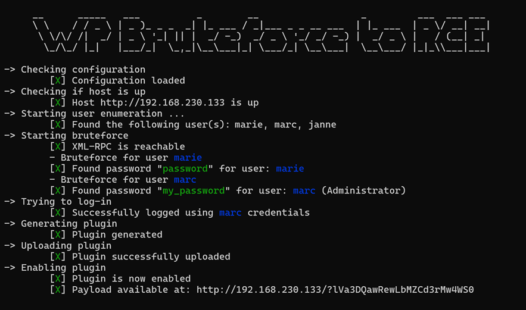

# WP Bruteforce to RCE

***Warning:*** This tool is for educational purpose only. It must be used on your own WordPress instance or during a 
CTF like event.

This is a quick and little project aimed to be a penetration testing tool. It automates the following tasks on WordPress:
- Enumerate users
- Brute force users password using `XLM-RPC` (will fail if disabled)
- Generate a malicious plugin
- Login, upload and enable the plugin
- Generate a link to trigger the plugin code execution

<br />

## Screenshot



<br />

## Requirements

Requires NodeJS `>=18.17`

<br />

## Setup

```bash
git clone https://github.com/PTLearnerSec/wp-bruteforce-to-rce.git
cd wp-bruteforce-to-rce
npm install
```

<br />

## Usage

***Configuration:***

- Open `config/appConfig.js` and put the relevant information
    - `app`
        - `pluginFilePath`: \<string\> Path to PHP file for plugin (by default runs `shell_exec` to get current user, OS and path)
        - `archivePath`: \<string\> Path to store plugin once generated
    - `host`
        - `url`: \<string\> Target url
    - `bruteforce`:
        - `wordlist`: \<string\> Path to passwords list to use
        - `concurrencyLimit`: \<integer\> Max number of simultaneous requests
        - `userAgent`: \<string\> The user agent to use in the request
  - `debug`: \<boolean\> Debug mode
 
<br />

***Run:***

```bash
node index.js
```

<br />

## Wordlist

One password list is already in the `wordlist` directory, you can find more in the 
[SecLists](https://github.com/danielmiessler/SecLists/tree/master/Passwords) repository.

<br />

##  What to learn from this on your own WordPress?

Make user enumeration harder:
- Restrict access to `/wp-json/`  API REST for non-authenticated users
- Remove author sitemap
- Unset `author_url` fields from ``oEmbed`` response data

Make brute forcing harder:
- Use strong password
- Disable ``XLM-RPC`` if not necessary for backward compatibility
- Watch out for brute force attack by limiting the number of login attempts using IP ban or timeout. Using captcha could also be helpful.

General advice:
- If you have multiple users, give admin rights only if absolutely necessary

<br />

## TODO

- Switch method if XML-RPC is disabled
- Check if a plugin with the same name is already uploaded
- Maybe more...